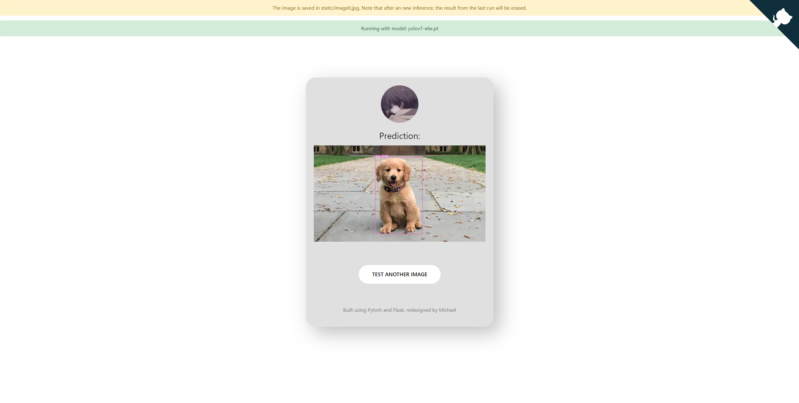
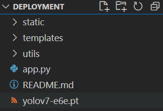

<H1 align="center">
Yolov7 Flask </H1>
<h4 align = "center">
A Beautiful Flask Framework for Implementing the Latest Yolov7 Model </h4>
<p align = "center">
  
  
  
  
</p>
<div align = "center">
  
   <br>
</div> 


<div align="center">
  
  <br>
  
  
</div>
I developed this API for the purpose of deploying my own Yolov7 model, which is a very accurate skin burn detector. For more information about that project please check out this repo:

https://github.com/Michael-OvO/Burn-Detection-Classification


## Installation & Usage: 




To run this, please make sure you follow the following steps:

a trained Yolov7 model (or you can also use the official pretrained yolov7 models), they can be downloaded [here](https://github.com/WongKinYiu/yolov7/releases). 

Once you have downloaded files, proceed to the next step. The feature of this web app is that it does not require a specific model name, as I have written code to directly search for the model file that is inside this directory (so you do not need to modify anything and just run it). **But do note that please just put one model file into your directory a single time, or else the code will not run properly.**  - the green bar on top of the page will display which model is currently being inferenced on your machine. 

Make sure you have met the following requirements:

\- PyTorch >= 1.6

\- flask

\- and dependencies required by Yolov7 (if you git cloned the original yolov7 repo then simply run ``` pip install -r requirements.txt``` inside the yolov7 repo)  

then, to launch the app, run the following command:

```bash
$ FLASK_ENV=development FLASK_APP=app.py flask run
```

then, visit http://localhost:5000/ in your browser.

choose some pictures that the model has been trained on and test it out!

## Demonstration: 

I will be using ```yolov7-e6e.pt``` for this demo and I am currently working with a RTX 3070Ti. 

My directory setup is like this:



Then running the ```app.py``` yields the following output:

(if it is first time running, it may take a while to download the original repo

```bash
Using cache found in C:[PATH/To/Your/Cache].cache\torch\hub\WongKinYiu_yolov7_main

                 from  n    params  module                                  arguments
  0                -1  1         0  models.common.ReOrg                     []
  1                -1  1      8800  models.common.Conv                      [12, 80, 3, 1]
  2                -1  1     70880  models.common.DownC                     [80, 160, 1]
  3                -1  1     10368  models.common.Conv                      [160, 64, 1, 1]
  4                -2  1     10368  models.common.Conv                      [160, 64, 1, 1]
  5                -1  1     36992  models.common.Conv                      [64, 64, 3, 1]
  6                -1  1     36992  models.common.Conv                      [64, 64, 3, 1]
  7                -1  1     36992  models.common.Conv                      [64, 64, 3, 1]
  8                -1  1     36992  models.common.Conv                      [64, 64, 3, 1]
  9                -1  1     36992  models.common.Conv                      [64, 64, 3, 1]
 10                -1  1     36992  models.common.Conv                      [64, 64, 3, 1]
 11[-1, -3, -5, -7, -8]  1         0  models.common.Concat                    [1]
 12                -1  1     51520  models.common.Conv                      [320, 160, 1, 1]
 13               -11  1     10368  models.common.Conv                      [160, 64, 1, 1]
 14               -12  1     10368  models.common.Conv                      [160, 64, 1, 1]
 15                -1  1     36992  models.common.Conv                      [64, 64, 3, 1]
 16                -1  1     36992  models.common.Conv                      [64, 64, 3, 1]
 17                -1  1     36992  models.common.Conv                      [64, 64, 3, 1]
 18                -1  1     36992  models.common.Conv                      [64, 64, 3, 1]
 19                -1  1     36992  models.common.Conv                      [64, 64, 3, 1]
 20                -1  1     36992  models.common.Conv                      [64, 64, 3, 1]
 21[-1, -3, -5, -7, -8]  1         0  models.common.Concat                    [1]
 22                -1  1     51520  models.common.Conv                      [320, 160, 1, 1]
 23         [-1, -11]  1         0  models.common.Shortcut                  [1]
 24                -1  1    282560  models.common.DownC                     [160, 320, 1]
 25                -1  1     41216  models.common.Conv                      [320, 128, 1, 1]
 26                -2  1     41216  models.common.Conv                      [320, 128, 1, 1]
 27                -1  1    147712  models.common.Conv                      [128, 128, 3, 1]
 28                -1  1    147712  models.common.Conv                      [128, 128, 3, 1]
 29                -1  1    147712  models.common.Conv                      [128, 128, 3, 1]
 30                -1  1    147712  models.common.Conv                      [128, 128, 3, 1]
 31                -1  1    147712  models.common.Conv                      [128, 128, 3, 1]
 32                -1  1    147712  models.common.Conv                      [128, 128, 3, 1]
 33[-1, -3, -5, -7, -8]  1         0  models.common.Concat                    [1]
 34                -1  1    205440  models.common.Conv                      [640, 320, 1, 1]
 35               -11  1     41216  models.common.Conv                      [320, 128, 1, 1]
 36               -12  1     41216  models.common.Conv                      [320, 128, 1, 1]
 37                -1  1    147712  models.common.Conv                      [128, 128, 3, 1]
 38                -1  1    147712  models.common.Conv                      [128, 128, 3, 1]
 39                -1  1    147712  models.common.Conv                      [128, 128, 3, 1]
 40                -1  1    147712  models.common.Conv                      [128, 128, 3, 1]
 41                -1  1    147712  models.common.Conv                      [128, 128, 3, 1]
 42                -1  1    147712  models.common.Conv                      [128, 128, 3, 1]
 43[-1, -3, -5, -7, -8]  1         0  models.common.Concat                    [1]
 44                -1  1    205440  models.common.Conv                      [640, 320, 1, 1]
 45         [-1, -11]  1         0  models.common.Shortcut                  [1]
 46                -1  1   1128320  models.common.DownC                     [320, 640, 1]
 47                -1  1    164352  models.common.Conv                      [640, 256, 1, 1]
 48                -2  1    164352  models.common.Conv                      [640, 256, 1, 1]
 49                -1  1    590336  models.common.Conv                      [256, 256, 3, 1]
 50                -1  1    590336  models.common.Conv                      [256, 256, 3, 1]
 51                -1  1    590336  models.common.Conv                      [256, 256, 3, 1]
 52                -1  1    590336  models.common.Conv                      [256, 256, 3, 1]
 53                -1  1    590336  models.common.Conv                      [256, 256, 3, 1]
 54                -1  1    590336  models.common.Conv                      [256, 256, 3, 1]
 55[-1, -3, -5, -7, -8]  1         0  models.common.Concat                    [1]
 56                -1  1    820480  models.common.Conv                      [1280, 640, 1, 1]
 57               -11  1    164352  models.common.Conv                      [640, 256, 1, 1]
 58               -12  1    164352  models.common.Conv                      [640, 256, 1, 1]
 59                -1  1    590336  models.common.Conv                      [256, 256, 3, 1]
 60                -1  1    590336  models.common.Conv                      [256, 256, 3, 1]
 61                -1  1    590336  models.common.Conv                      [256, 256, 3, 1]
 62                -1  1    590336  models.common.Conv                      [256, 256, 3, 1]
 63                -1  1    590336  models.common.Conv                      [256, 256, 3, 1]
 64                -1  1    590336  models.common.Conv                      [256, 256, 3, 1]
 65[-1, -3, -5, -7, -8]  1         0  models.common.Concat                    [1]
 66                -1  1    820480  models.common.Conv                      [1280, 640, 1, 1]
 67         [-1, -11]  1         0  models.common.Shortcut                  [1]
 68                -1  1   3484800  models.common.DownC                     [640, 960, 1]
 69                -1  1    369408  models.common.Conv                      [960, 384, 1, 1]
 70                -2  1    369408  models.common.Conv                      [960, 384, 1, 1]
 71                -1  1   1327872  models.common.Conv                      [384, 384, 3, 1]
 72                -1  1   1327872  models.common.Conv                      [384, 384, 3, 1]
 73                -1  1   1327872  models.common.Conv                      [384, 384, 3, 1]
 74                -1  1   1327872  models.common.Conv                      [384, 384, 3, 1]
 75                -1  1   1327872  models.common.Conv                      [384, 384, 3, 1]
 76                -1  1   1327872  models.common.Conv                      [384, 384, 3, 1]
 77[-1, -3, -5, -7, -8]  1         0  models.common.Concat                    [1]
 78                -1  1   1845120  models.common.Conv                      [1920, 960, 1, 1]
 79               -11  1    369408  models.common.Conv                      [960, 384, 1, 1]
 80               -12  1    369408  models.common.Conv                      [960, 384, 1, 1]
 81                -1  1   1327872  models.common.Conv                      [384, 384, 3, 1]
 82                -1  1   1327872  models.common.Conv                      [384, 384, 3, 1]
 83                -1  1   1327872  models.common.Conv                      [384, 384, 3, 1]
 84                -1  1   1327872  models.common.Conv                      [384, 384, 3, 1]
 85                -1  1   1327872  models.common.Conv                      [384, 384, 3, 1]
 86                -1  1   1327872  models.common.Conv                      [384, 384, 3, 1]
 87[-1, -3, -5, -7, -8]  1         0  models.common.Concat                    [1]
 88                -1  1   1845120  models.common.Conv                      [1920, 960, 1, 1]
 89         [-1, -11]  1         0  models.common.Shortcut                  [1]
 90                -1  1   7070080  models.common.DownC                     [960, 1280, 1]
 91                -1  1    656384  models.common.Conv                      [1280, 512, 1, 1]
 92                -2  1    656384  models.common.Conv                      [1280, 512, 1, 1]
 93                -1  1   2360320  models.common.Conv                      [512, 512, 3, 1]
 94                -1  1   2360320  models.common.Conv                      [512, 512, 3, 1]
 95                -1  1   2360320  models.common.Conv                      [512, 512, 3, 1]
 96                -1  1   2360320  models.common.Conv                      [512, 512, 3, 1]
 97                -1  1   2360320  models.common.Conv                      [512, 512, 3, 1]
 98                -1  1   2360320  models.common.Conv                      [512, 512, 3, 1]
 99[-1, -3, -5, -7, -8]  1         0  models.common.Concat                    [1]
100                -1  1   3279360  models.common.Conv                      [2560, 1280, 1, 1]
101               -11  1    656384  models.common.Conv                      [1280, 512, 1, 1]
102               -12  1    656384  models.common.Conv                      [1280, 512, 1, 1]
103                -1  1   2360320  models.common.Conv                      [512, 512, 3, 1]
104                -1  1   2360320  models.common.Conv                      [512, 512, 3, 1]
105                -1  1   2360320  models.common.Conv                      [512, 512, 3, 1]
106                -1  1   2360320  models.common.Conv                      [512, 512, 3, 1]
107                -1  1   2360320  models.common.Conv                      [512, 512, 3, 1]
108                -1  1   2360320  models.common.Conv                      [512, 512, 3, 1]
109[-1, -3, -5, -7, -8]  1         0  models.common.Concat                    [1]
110                -1  1   3279360  models.common.Conv                      [2560, 1280, 1, 1]
111         [-1, -11]  1         0  models.common.Shortcut                  [1]
112                -1  1  11887360  models.common.SPPCSPC                   [1280, 640, 1]
113                -1  1    308160  models.common.Conv                      [640, 480, 1, 1]
114                -1  1         0  torch.nn.modules.upsampling.Upsample    [None, 2, 'nearest']
115                89  1    461760  models.common.Conv                      [960, 480, 1, 1]
116          [-1, -2]  1         0  models.common.Concat                    [1]
117                -1  1    369408  models.common.Conv                      [960, 384, 1, 1]
118                -2  1    369408  models.common.Conv                      [960, 384, 1, 1]
119                -1  1    663936  models.common.Conv                      [384, 192, 3, 1]
120                -1  1    332160  models.common.Conv                      [192, 192, 3, 1]
121                -1  1    332160  models.common.Conv                      [192, 192, 3, 1]
122                -1  1    332160  models.common.Conv                      [192, 192, 3, 1]
123                -1  1    332160  models.common.Conv                      [192, 192, 3, 1]
124                -1  1    332160  models.common.Conv                      [192, 192, 3, 1]
125[-1, -2, -3, -4, -5, -6, -7, -8]  1         0  models.common.Concat                    [1]
126                -1  1    922560  models.common.Conv                      [1920, 480, 1, 1]
127               -11  1    369408  models.common.Conv                      [960, 384, 1, 1]
128               -12  1    369408  models.common.Conv                      [960, 384, 1, 1]
129                -1  1    663936  models.common.Conv                      [384, 192, 3, 1]
130                -1  1    332160  models.common.Conv                      [192, 192, 3, 1]
131                -1  1    332160  models.common.Conv                      [192, 192, 3, 1]
132                -1  1    332160  models.common.Conv                      [192, 192, 3, 1]
133                -1  1    332160  models.common.Conv                      [192, 192, 3, 1]
134                -1  1    332160  models.common.Conv                      [192, 192, 3, 1]
135[-1, -2, -3, -4, -5, -6, -7, -8]  1         0  models.common.Concat                    [1]
136                -1  1    922560  models.common.Conv                      [1920, 480, 1, 1]
137         [-1, -11]  1         0  models.common.Shortcut                  [1]
138                -1  1    154240  models.common.Conv                      [480, 320, 1, 1]
139                -1  1         0  torch.nn.modules.upsampling.Upsample    [None, 2, 'nearest']
140                67  1    205440  models.common.Conv                      [640, 320, 1, 1]
141          [-1, -2]  1         0  models.common.Concat                    [1]
142                -1  1    164352  models.common.Conv                      [640, 256, 1, 1]
143                -2  1    164352  models.common.Conv                      [640, 256, 1, 1]
144                -1  1    295168  models.common.Conv                      [256, 128, 3, 1]
145                -1  1    147712  models.common.Conv                      [128, 128, 3, 1]
146                -1  1    147712  models.common.Conv                      [128, 128, 3, 1]
147                -1  1    147712  models.common.Conv                      [128, 128, 3, 1]
148                -1  1    147712  models.common.Conv                      [128, 128, 3, 1]
149                -1  1    147712  models.common.Conv                      [128, 128, 3, 1]
150[-1, -2, -3, -4, -5, -6, -7, -8]  1         0  models.common.Concat                    [1]
151                -1  1    410240  models.common.Conv                      [1280, 320, 1, 1]
152               -11  1    164352  models.common.Conv                      [640, 256, 1, 1]
153               -12  1    164352  models.common.Conv                      [640, 256, 1, 1]
154                -1  1    295168  models.common.Conv                      [256, 128, 3, 1]
155                -1  1    147712  models.common.Conv                      [128, 128, 3, 1]
156                -1  1    147712  models.common.Conv                      [128, 128, 3, 1]
157                -1  1    147712  models.common.Conv                      [128, 128, 3, 1]
158                -1  1    147712  models.common.Conv                      [128, 128, 3, 1]
159                -1  1    147712  models.common.Conv                      [128, 128, 3, 1]
160[-1, -2, -3, -4, -5, -6, -7, -8]  1         0  models.common.Concat                    [1]
161                -1  1    410240  models.common.Conv                      [1280, 320, 1, 1]
162         [-1, -11]  1         0  models.common.Shortcut                  [1]
163                -1  1     51520  models.common.Conv                      [320, 160, 1, 1]
164                -1  1         0  torch.nn.modules.upsampling.Upsample    [None, 2, 'nearest']
165                45  1     51520  models.common.Conv                      [320, 160, 1, 1]
166          [-1, -2]  1         0  models.common.Concat                    [1]
167                -1  1     41216  models.common.Conv                      [320, 128, 1, 1]
168                -2  1     41216  models.common.Conv                      [320, 128, 1, 1]
169                -1  1     73856  models.common.Conv                      [128, 64, 3, 1]
170                -1  1     36992  models.common.Conv                      [64, 64, 3, 1]
171                -1  1     36992  models.common.Conv                      [64, 64, 3, 1]
172                -1  1     36992  models.common.Conv                      [64, 64, 3, 1]
173                -1  1     36992  models.common.Conv                      [64, 64, 3, 1]
174                -1  1     36992  models.common.Conv                      [64, 64, 3, 1]
175[-1, -2, -3, -4, -5, -6, -7, -8]  1         0  models.common.Concat                    [1]
176                -1  1    102720  models.common.Conv                      [640, 160, 1, 1]
177               -11  1     41216  models.common.Conv                      [320, 128, 1, 1]
178               -12  1     41216  models.common.Conv                      [320, 128, 1, 1]
179                -1  1     73856  models.common.Conv                      [128, 64, 3, 1]
180                -1  1     36992  models.common.Conv                      [64, 64, 3, 1]
181                -1  1     36992  models.common.Conv                      [64, 64, 3, 1]
182                -1  1     36992  models.common.Conv                      [64, 64, 3, 1]
183                -1  1     36992  models.common.Conv                      [64, 64, 3, 1]
184                -1  1     36992  models.common.Conv                      [64, 64, 3, 1]
185[-1, -2, -3, -4, -5, -6, -7, -8]  1         0  models.common.Concat                    [1]
186                -1  1    102720  models.common.Conv                      [640, 160, 1, 1]
187         [-1, -11]  1         0  models.common.Shortcut                  [1]
188                -1  1    282560  models.common.DownC                     [160, 320, 1]
189         [-1, 162]  1         0  models.common.Concat                    [1]
190                -1  1    164352  models.common.Conv                      [640, 256, 1, 1]
191                -2  1    164352  models.common.Conv                      [640, 256, 1, 1]
192                -1  1    295168  models.common.Conv                      [256, 128, 3, 1]
193                -1  1    147712  models.common.Conv                      [128, 128, 3, 1]
194                -1  1    147712  models.common.Conv                      [128, 128, 3, 1]
195                -1  1    147712  models.common.Conv                      [128, 128, 3, 1]
196                -1  1    147712  models.common.Conv                      [128, 128, 3, 1]
197                -1  1    147712  models.common.Conv                      [128, 128, 3, 1]
198[-1, -2, -3, -4, -5, -6, -7, -8]  1         0  models.common.Concat                    [1]
199                -1  1    410240  models.common.Conv                      [1280, 320, 1, 1]
200               -11  1    164352  models.common.Conv                      [640, 256, 1, 1]
201               -12  1    164352  models.common.Conv                      [640, 256, 1, 1]
202                -1  1    295168  models.common.Conv                      [256, 128, 3, 1]
203                -1  1    147712  models.common.Conv                      [128, 128, 3, 1]
204                -1  1    147712  models.common.Conv                      [128, 128, 3, 1]
205                -1  1    147712  models.common.Conv                      [128, 128, 3, 1]
206                -1  1    147712  models.common.Conv                      [128, 128, 3, 1]
207                -1  1    147712  models.common.Conv                      [128, 128, 3, 1]
208[-1, -2, -3, -4, -5, -6, -7, -8]  1         0  models.common.Concat                    [1]
209                -1  1    410240  models.common.Conv                      [1280, 320, 1, 1]
210         [-1, -11]  1         0  models.common.Shortcut                  [1]
211                -1  1    872000  models.common.DownC                     [320, 480, 1]
212         [-1, 137]  1         0  models.common.Concat                    [1]
213                -1  1    369408  models.common.Conv                      [960, 384, 1, 1]
214                -2  1    369408  models.common.Conv                      [960, 384, 1, 1]
215                -1  1    663936  models.common.Conv                      [384, 192, 3, 1]
216                -1  1    332160  models.common.Conv                      [192, 192, 3, 1]
217                -1  1    332160  models.common.Conv                      [192, 192, 3, 1]
218                -1  1    332160  models.common.Conv                      [192, 192, 3, 1]
219                -1  1    332160  models.common.Conv                      [192, 192, 3, 1]
220                -1  1    332160  models.common.Conv                      [192, 192, 3, 1]
221[-1, -2, -3, -4, -5, -6, -7, -8]  1         0  models.common.Concat                    [1]
222                -1  1    922560  models.common.Conv                      [1920, 480, 1, 1]
223               -11  1    369408  models.common.Conv                      [960, 384, 1, 1]
224               -12  1    369408  models.common.Conv                      [960, 384, 1, 1]
225                -1  1    663936  models.common.Conv                      [384, 192, 3, 1]
226                -1  1    332160  models.common.Conv                      [192, 192, 3, 1]
227                -1  1    332160  models.common.Conv                      [192, 192, 3, 1]
228                -1  1    332160  models.common.Conv                      [192, 192, 3, 1]
229                -1  1    332160  models.common.Conv                      [192, 192, 3, 1]
230                -1  1    332160  models.common.Conv                      [192, 192, 3, 1]
231[-1, -2, -3, -4, -5, -6, -7, -8]  1         0  models.common.Concat                    [1]
232                -1  1    922560  models.common.Conv                      [1920, 480, 1, 1]
233         [-1, -11]  1         0  models.common.Shortcut                  [1]
234                -1  1   1768640  models.common.DownC                     [480, 640, 1]
235         [-1, 112]  1         0  models.common.Concat                    [1]
236                -1  1    656384  models.common.Conv                      [1280, 512, 1, 1]
237                -2  1    656384  models.common.Conv                      [1280, 512, 1, 1]
238                -1  1   1180160  models.common.Conv                      [512, 256, 3, 1]
239                -1  1    590336  models.common.Conv                      [256, 256, 3, 1]
240                -1  1    590336  models.common.Conv                      [256, 256, 3, 1]
241                -1  1    590336  models.common.Conv                      [256, 256, 3, 1]
242                -1  1    590336  models.common.Conv                      [256, 256, 3, 1]
243                -1  1    590336  models.common.Conv                      [256, 256, 3, 1]
244[-1, -2, -3, -4, -5, -6, -7, -8]  1         0  models.common.Concat                    [1]
245                -1  1   1639680  models.common.Conv                      [2560, 640, 1, 1]
246               -11  1    656384  models.common.Conv                      [1280, 512, 1, 1]
247               -12  1    656384  models.common.Conv                      [1280, 512, 1, 1]
248                -1  1   1180160  models.common.Conv                      [512, 256, 3, 1]
249                -1  1    590336  models.common.Conv                      [256, 256, 3, 1]
250                -1  1    590336  models.common.Conv                      [256, 256, 3, 1]
251                -1  1    590336  models.common.Conv                      [256, 256, 3, 1]
252                -1  1    590336  models.common.Conv                      [256, 256, 3, 1]
253                -1  1    590336  models.common.Conv                      [256, 256, 3, 1]
254[-1, -2, -3, -4, -5, -6, -7, -8]  1         0  models.common.Concat                    [1]
255                -1  1   1639680  models.common.Conv                      [2560, 640, 1, 1]
256         [-1, -11]  1         0  models.common.Shortcut                  [1]
257               187  1    461440  models.common.Conv                      [160, 320, 3, 1]
258               210  1   1844480  models.common.Conv                      [320, 640, 3, 1]
259               233  1   4149120  models.common.Conv                      [480, 960, 3, 1]
260               256  1   7375360  models.common.Conv                      [640, 1280, 3, 1]
261[257, 258, 259, 260]  1    817020  models.yolo.Detect                      [80, [[19, 27, 44, 40, 38, 94], [96, 68, 86, 152, 180, 137], [140, 301, 303, 264, 238, 542], [436, 615, 739, 380, 925, 792]], [320, 640, 960, 1280]]
C:PATH\TO\YOUR\anaconda3\lib\site-packages\torch\functional.py:445: UserWarning: torch.meshgrid: in an upcoming release, it will be required to pass the indexing argument. (Triggered internally at  ..\aten\src\ATen\native\TensorShape.cpp:2157.)
  return _VF.meshgrid(tensors, **kwargs)  # type: ignore[attr-defined]
Model Summary: 1032 layers, 151757244 parameters, 151757244 gradients, 211.6 GFLOPS

Adding autoShape... 
YOLOR  2022-8-24 torch 1.10.2 CUDA:0 (NVIDIA GeForce RTX 3070 Ti, 8191.375MB)

 * Debug mode: off
WARNING: This is a development server. Do not use it in a production deployment. Use a production WSGI server instead.
 * Running on http://YOUR_IP_ADDRESS:5000
Press CTRL+C to quit
```

Then, simply control + click on the address will bring you to the flask app.

The original yolov7 pretrained weights was trained on MS COCO dataset, so it could recognize a dog:


Have fun using this framework!

## Todos:

- [x] Basic Functionalities and CSS layout
- [x] Model Indicator & Automatically search for model weights
- [ ] Support for video
- [ ] Support for webcam 

(If there are requests to add these 2 features please let me know. I will consider adding it)

## Acknowledgment:

This framework was rewritten from this repo:

https://github.com/robmarkcole/yolov5-flask


